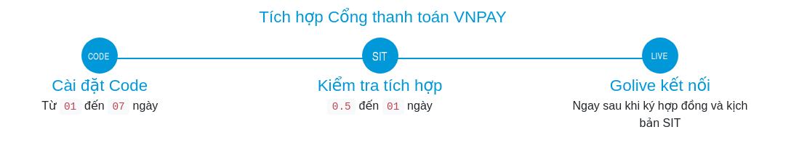

## Giới thiệu

Lập trình viên code theo [Tài liệu đặc tả kết nối](https://sandbox.vnpayment.vn/apis/downloads/#t%C3%A0i-li%E1%BB%87u-%C4%91%E1%BA%B7c-t%E1%BA%A3-k%E1%BB%B9-thu%E1%BA%ADt) mà VNPPAY cung cấp để tích hợp vào phần mềm của đơn vị.

Hiện VNPAY đã hỗ trợ demo cho các ngôn ngữ lập trình: PHP, C#, Python, Java, NodeJS.

## Thông tin cấu hình

Mỗi website sẽ được VNPAY cấp 2 thông tin cấu hình để định danh website đó trên hệ thống Cổng thanh toán:

* `vnp_TmnCode` : Mã của website được khai báo tại hệ thống Cổng thanh toán VNPAY.
* `vnp_HashSecret` : Chuỗi bí mật sử dụng để kiểm tra toàn vẹn dữ liệu khi hai hệ thống trao đổi thông tin (checksum).
* `URL thanh toán` : http://sandbox.vnpayment.vn/paymentv2/vpcpay.html
* `URL API truy vấn` : Giống `API Hoàn trả`
* `API Hoàn trả` : http://sandbox.vnpayment.vn/merchant_webapi/merchant.html

## Thông tin thẻ test

Để thực hiện giao dịch thành công trên môi trường test, sử dụng thông tin thẻ sau:

    Ngân hàng: NCB
    Số thẻ: 9704198526191432198
    Tên chủ thẻ: NGUYEN VAN A
    Ngày phát hành: 07/15
    Mật khẩu OTP: 123456

Có thể sử dụng thêm [thẻ test tại đây](https://sandbox.vnpayment.vn/apis/vnpay-demo/#th%C3%B4ng-tin-th%E1%BA%BB-test)

## Timeline

    

